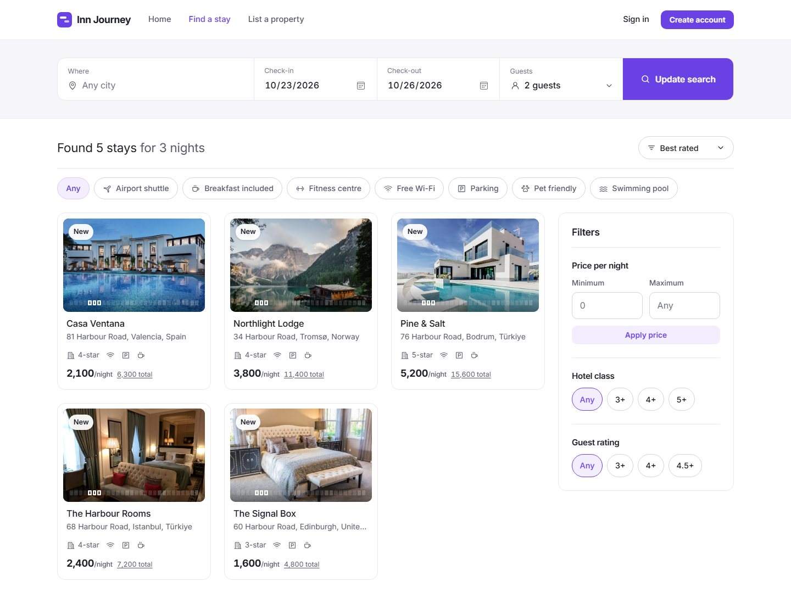
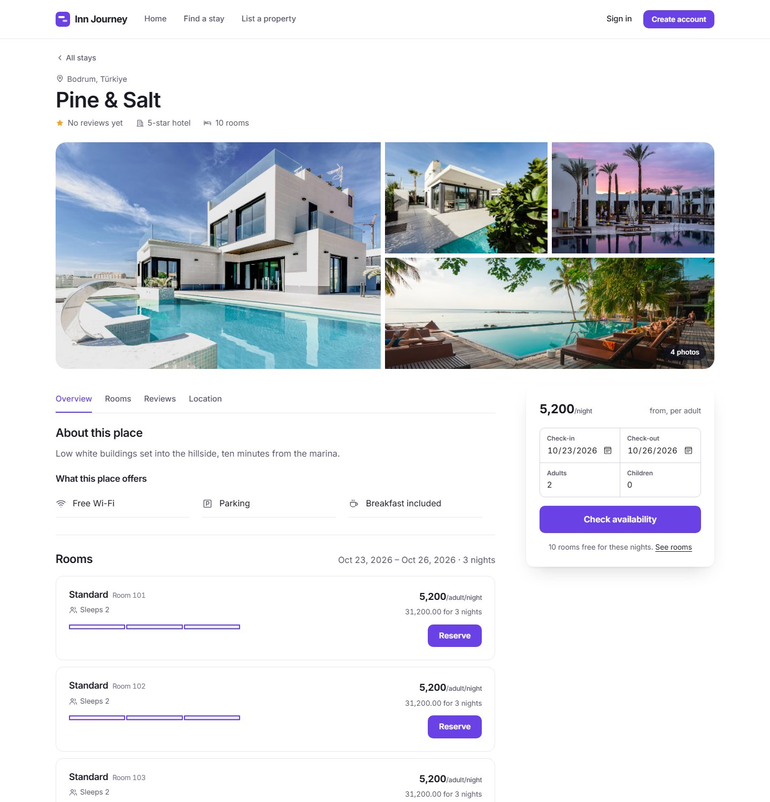
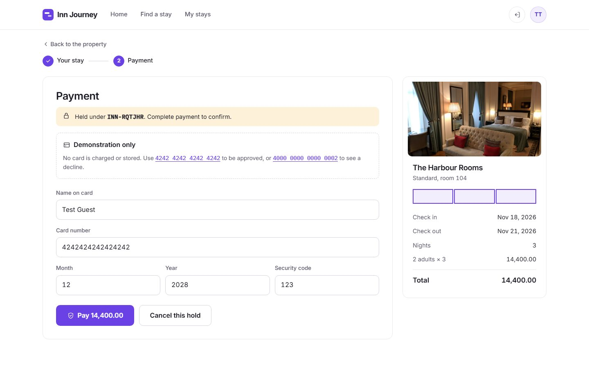
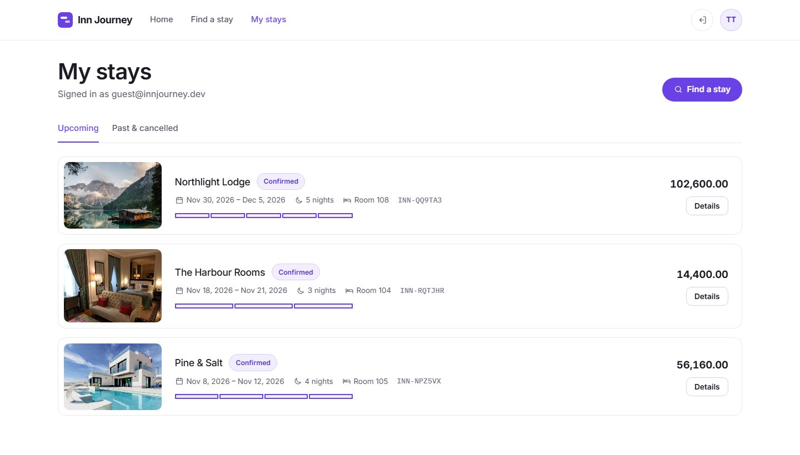
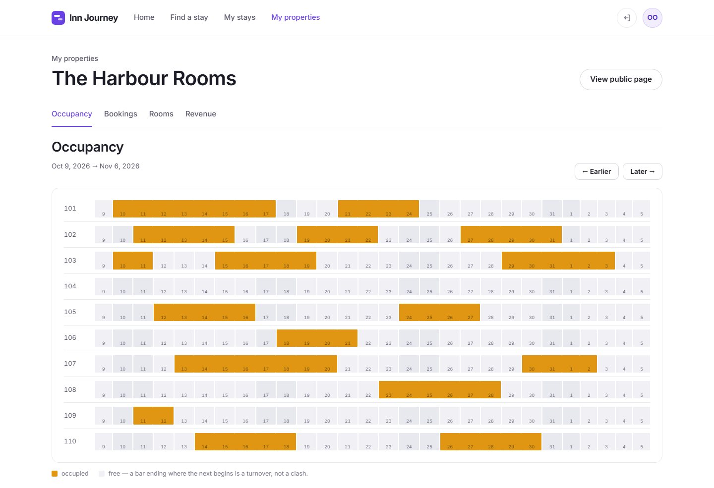
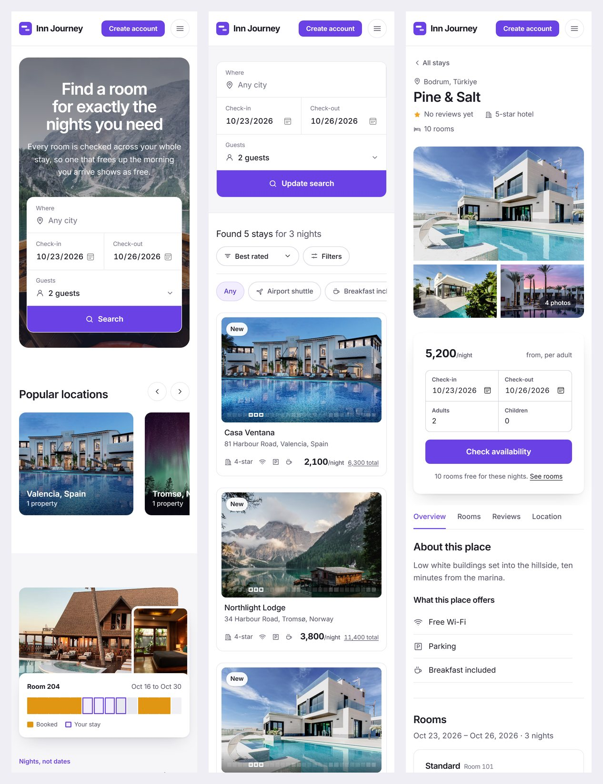
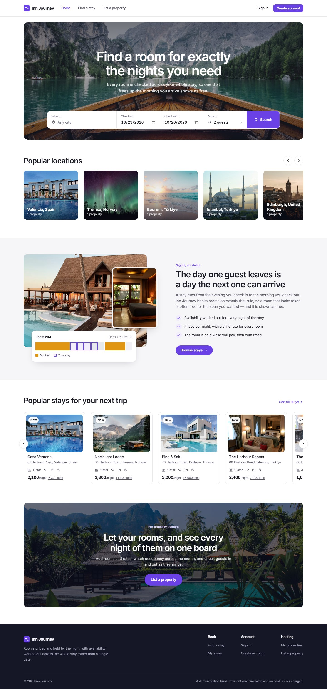

# Inn Journey

A hotel reservation platform. Travellers search by the nights they need, book a room and pay for it, then review the stay once it is done. Hotel owners manage their properties, rooms and bookings from an occupancy board. Administrators curate the catalogues that every property shares.

## Booked by the night

Most booking sites ask you for a date. Inn Journey asks for the nights you actually need, and answers for the whole stretch at once.

A stay runs from the evening you arrive to the morning you leave, which means the day one guest checks out is a day the next guest can check in. A room that looks taken is often free for exactly the span you wanted. Inn Journey shows it as free, because it is.

Everything you see in a search is bookable for the nights you asked for. There is no second check at the end that quietly takes the room away.

Those nights are drawn as a band that runs through the whole site a strip beneath a search result, a fuller stretch on a property's page, a wall of rooms against dates on an owner's dashboard. It is the same picture at every size, so once you have read it once you can read it anywhere.

## For travellers

Search everywhere at once or narrow to a city, then filter by price, guest rating, star classification, and the facilities that decide it parking, breakfast, a pool, somewhere that takes the dog.

Open a property to see its rooms priced for your dates. Rates are per night and per guest, with children charged at the room's own rate, so the figure you are shown is the figure you pay. Choose a room, pay, and the booking is confirmed with a reference you can quote.

Your account keeps upcoming and past stays in one place. Plans change, so a booking can be cancelled and refunded, and once you have checked out you can leave a review.

## For hotel owners

An owner's dashboard opens on the occupancy board: every room against every night, so a quiet fortnight or a fully booked weekend is obvious at a glance.

Alongside it sits the booking queue arrivals to confirm, guests to check in, guests to check out — plus the rooms themselves, their capacity and their pricing, and what the property has earned over a chosen stretch of dates.

An owner sees their own properties and nothing else. Two owners on the same platform never see each other's guests, bookings or takings.

## For administrators

Facilities and room types belong to the whole platform rather than to any one hotel, so "Breakfast included" means the same thing on every property that claims it. Administrators curate those shared lists, which is what keeps search filters honest.

## Reviews that had to be earned

A review can only be written by someone who actually completed a stay, and only once per stay. There is no way to leave one without having been a guest.

A property's rating is the average of those reviews and nothing else moves it. That is deliberately separate from the star classification, which is what the owner claims about the property rather than what guests found.

## Screenshots

**A property's page.** Photos, facilities, and every room priced for the nights you asked for.

**Paying for a stay.** The room is held while you pay, and confirmed once the payment goes through.

**Your stays.** Upcoming and past bookings in one place.

**The occupancy board.** Every room against every night, so a quiet fortnight or a fully booked weekend shows at a glance.

**On a phone.**

The full home page

## About this project

Inn Journey is a demonstration build, seeded with a handful of properties across a few countries so the whole flow can be walked end to end search, book, pay, check out, review.

Payments are simulated. No card is ever charged or stored, and the project runs without a merchant account of any kind.

## Licence

MIT. See [LICENSE](LICENSE).
